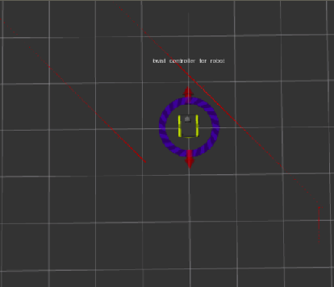

optimal_filters
=========

This repo contains some optimal filters implemented in C/C++ and Python 3.6.6. The repo examples have been tested using GCC 5.4.0 and an Anaconda virtual environment with Python3.6.6 and the following python modules:
 - numpy
 - pandas
 - matplotlib

The scripts take in previously formatted ROS data (.bag files converted into .csv files) from the data folder

## Overview

**static_system_estimator**

The first filter *static_system_estimator*, as the name tells, estimates the values of a range of laser scans retrieved by a SICK LMS111 LIDAR sensor in a ROS Kinetic/Gazebo 7 simulation. During the simulation, the *Jackal robot* that integrates the laser does not move and therefore the readings should be the same. The filter could be used to estimate more accurate ranges; the last part of the script plots both the initial guess and the final estimate.

## Authors

* **Victor Sandoval** - [daconjurer](https://github.com/daconjurer)

## Acknowledgments

* The *static_system_estimator* uses data collected by running the [Jackal robot](https://www.clearpathrobotics.com/assets/guides/jackal/simulation.html) simulation node on Gazebo.
